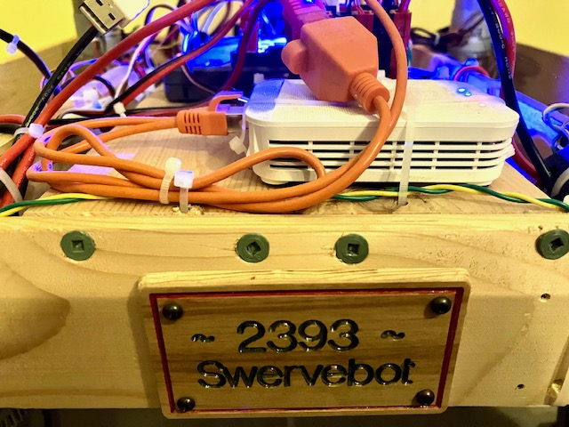

Team 2393 FRC Season 2025
=========================

Game manual: https://www.firstinspires.org/resource-library/frc/competition-manual-qa-system

Software manual: https://docs.wpilib.org/en/stable/

 * The "Introduction" has links to Java learning resources.
   See also [Free Java Book](https://greenteapress.com/wp/think-java-2e/)
 * See "Step 2: Installing Software", "WPILib Installation Guide".
 * See "Basic Programming", "Git Version Control" for installing `git`

Get robot code
--------------
 * Start "2025 WPILib VS Code". Invoke "View", "Command Palette...", "Git clone".
   Enter the URL `https://github.com/team2393/FRC2025.git`.
   For a target location, create a folder "git" in your home directory
   and place the git clone there. Select "Open" when then asked to open
   what you just fetched from git.
 * "View", "Command Palette", "WPILib: Simulate Robot Code"
   * In simulation, use the menu "Network Tables",  "Smart Dashboard" to show "Field", "DemoMechanism" and "Selectable Chooser".
   * Connect joystick and drive around in teleop
   * Select auto option and run it in autonomous

Timeline
--------

 * Start with the "WPILib Installation Guide" mentioned above.
   Read the Software manual. Read all of it until "Advanced programming".
   May skip the details about LabVIEW, python, C++ since we're using Java.
   Glance throught the Advanced programming section to at least know
   what's in there.

   Additional PID resources:
   - https://trickingrockstothink.com/blog_posts/2019/10/19/tuning_pid.html
   - https://trickingrockstothink.com/blog_posts/2019/10/26/controls_supp_arm.html
   
   Prepare for next season by using the 2025Beta release

   - [X] Run Falcon and Pigeon with beta software
   - [X] Port swervebot to beta software

 * January 4: Kickoff, https://www.firstinspires.org/robotics/frc/kickoff, https://www.tnfirst.org/frc-events
   - [X] Install 2025 version of WPILib, driver station, CTRE tools (Phoenix Tuner) on robots laptop
   - [X] Run swervebot to kickoff software
   - [X] Configure new radio for usage similar to original radio:
     * Connect via DS port and see http://radio.local
     * Upgrade firmware https://frc-radio.vivid-hosting.net/overview/upgrading-firmware
     * Configure SSIDadn 2.4 GHz password, enable 2.4 GHz wifi via DIP #3

 * Throughout January & February
   - [X] Program drive base (swervebot, new swerve module test setup) with current software
   - [ ] Tune drive base
   - [X] Lift is functional, but brake for now always on
   - [ ] Support Lift's brake again.
         Send 'config'without blocking?
         Only update config when brake mode needs to change?
   - [ ] Prepare autonomous moves
   - [ ] Test any hardware that we'll likely use on the robot
   - [ ] Setup camera for April tag detection
   - [ ] If camera reports position, try CameraHelper to sync odometry
   - [X] Attempt command to swerve & rotate such that heading of robot is perpendicular to tag
   - [ ] Prepare software for other robot components as they are defined & designed

 * March
   - [ ] Test software for all robot components
   - [ ] Update autonomouse moves to include picking up game pieces etc.
   - [ ] Drive practice
   - [ ] March 30: STEM Dinner

 * April 2-5: Competition, https://frc-events.firstinspires.org/2025/Events/EventList

PhotonVision Camera
-------------------

Image Raspberry Pi with PhotonVision. Bootup with HDMI monitor connected to observe initial self-configuration. Reboot on robot network and navigate web browser on Laptop to http://photonvision.local:5800

Settings, Networking

 * Set Team Number to 2393.
 * Change IP Assignment Mode from DHCP to Static, set
   address to `10.23.93.12`. (Static `10.TE.AM.6-19` are general purpose. `10.TE.AM.11` is often used for camera, leave that for Limelight)
 * Leave "Hostname" as `photonvision`,
   or update CameraHelper to custom name. 
 * Press SAVE

From now on, access camera via http://10.23.93.12:5800

For more, see https://docs.photonvision.org/en/latest/docs/description.html