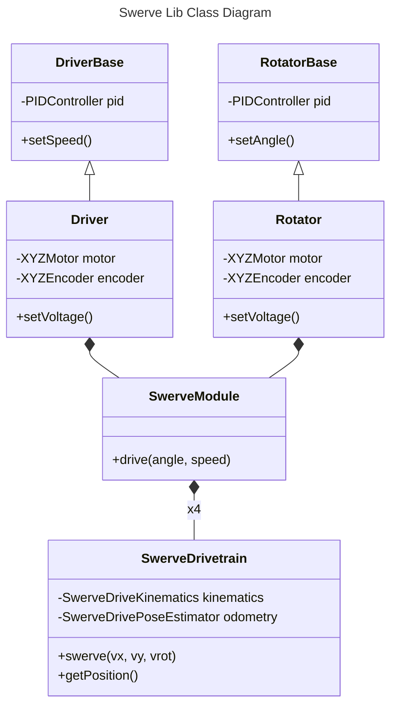

SwerveLib
=========

```mermaid
---
title: Swerve Lib Class Diagram
---
classDiagram
    DriverBase <|-- Driver
    RotatorBase <|-- Rotator
    Driver *-- SwerveModule
    Rotator *-- SwerveModule
    SwerveModule *-- SwerveDrivetrain : x4
    class DriverBase{
        -PIDController pid
        +setSpeed()
    }
    class Driver{
        -XYZMotor motor
        -XYZEncoder encoder
        +setVoltage()
    }
    class RotatorBase{
        -PIDController pid
        +setAngle()
    }
    class Rotator{
        -XYZMotor motor
        -XYZEncoder encoder
        +setVoltage()
    }
    class SwerveModule{
        +drive(angle, speed)
    }
    class SwerveDrivetrain{
        -SwerveDriveKinematics kinematics
        -SwerveDrivePoseEstimator odometry
        +swerve(vx, vy, vrot)
        +getPosition()
    }
```

